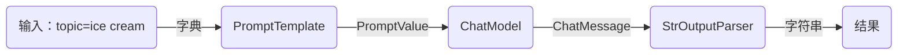
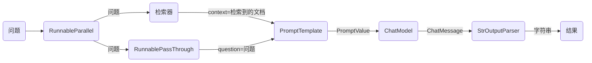

# LangChain表达式 起步
LCEL使得从基本组件构建复杂链条变得容易，并且支持诸如流式处理、并行处理和日志记录等开箱即用的功能。

## 基本示例：提示 + 模型 + 输出解析器

最基本和常见的用例是将提示模板和模型链接在一起。为了了解这是如何工作的，让我们创建一个链条，它接受一个主题并生成一个笑话：
%pip install --upgrade --quiet  langchain-core langchain-community langchain-openai

```python
from langchain_core.output_parsers import StrOutputParser
from langchain_core.prompts import ChatPromptTemplate
from langchain_openai import ChatOpenAI

prompt = ChatPromptTemplate.from_template("tell me a short joke about {topic}")
model = ChatOpenAI(model="gpt-4")
output_parser = StrOutputParser()

chain = prompt | model | output_parser

chain.invoke({"topic": "ice cream"})
```


    "为什么冰淇淋从不被邀请参加派对？\n\n因为当事情变热时，它们总是滴下来！"


请注意这行代码，我们使用LCEL将不同的组件组合成一个单一的链条：

```
chain = prompt | model | output_parser
```

`|` 符号类似于 [unix 管道操作符](https://en.wikipedia.org/wiki/Pipeline_(Unix))，它将不同的组件链接在一起，将一个组件的输出作为下一个组件的输入。

在这个链条中，用户输入被传递给提示模板，然后提示模板的输出被传递给模型，然后模型的输出被传递给输出解析器。让我们逐个组件地看一下，以真正理解发生了什么。

### 1. 提示

`prompt` 是一个 `BasePromptTemplate`，这意味着它接受一个模板变量的字典并生成一个 `PromptValue`。`PromptValue` 是一个包装完成的提示的包装器，可以传递给 `LLM`（它以字符串作为输入）或 `ChatModel`（它以消息序列作为输入）。它可以与任何语言模型类型一起使用，因为它定义了生成 `BaseMessage` 和生成字符串的逻辑。

```python
prompt_value = prompt.invoke({"topic": "ice cream"})
prompt_value
```


    ChatPromptValue(messages=[HumanMessage(content='tell me a short joke about ice cream')])


```python
prompt_value.to_messages()
```


    [HumanMessage(content='tell me a short joke about ice cream')]


```python
prompt_value.to_string()
```


    'Human: tell me a short joke about ice cream'


### 2. 模型

然后将 `PromptValue` 传递给 `model`。在这种情况下，我们的 `model` 是一个 `ChatModel`，这意味着它将输出一个 `BaseMessage`。

```python
message = model.invoke(prompt_value)
message
```


    AIMessage(content="为什么冰淇淋从不被邀请参加派对？\n\n因为当事情变热时，它们总是滴下来！")


如果我们的 `model` 是一个 `LLM`，它将输出一个字符串。

```python
from langchain_openai.llms import OpenAI

llm = OpenAI(model="gpt-3.5-turbo-instruct")
llm.invoke(prompt_value)
```


    '\n\nRobot: 冰淇淋车为什么坏了？因为它融化了！'


### 3. 输出解析器

最后，我们将 `model` 的输出传递给 `output_parser`，它是一个 `BaseOutputParser`，意味着它可以接受字符串或 `BaseMessage` 作为输入。`StrOutputParser` 简单地将任何输入转换为字符串。

```python
output_parser.invoke(message)
```


    "冰淇淋为什么去看心理医生？\n\n因为它有太多的配料，找不到自己的冰淇淋锥自信！"


### 4. 整个流程

按照以下步骤进行操作：

1. 我们将用户输入的主题作为 `{"topic": "ice cream"}` 传入。
2. `prompt` 组件接受用户输入，然后使用主题构建提示，生成 `PromptValue`。
3. `model` 组件接受生成的提示，并将其传递给 OpenAI LLM 模型进行评估。模型生成的输出是一个 `ChatMessage` 对象。
4. 最后，`output_parser` 组件接受一个 `ChatMessage`，将其转换为 Python 字符串，并从 `invoke` 方法返回。




:::info

请注意，如果您对任何组件的输出感到好奇，您可以始终测试链条的较小版本，例如 `prompt` 或 `prompt | model`，以查看中间结果：

:::


```python
input = {"topic": "ice cream"}

prompt.invoke(input)
# > ChatPromptValue(messages=[HumanMessage(content='tell me a short joke about ice cream')])

(prompt | model).invoke(input)
# > AIMessage(content="为什么冰淇淋去看心理医生？\n因为它有太多的配料，找不到自己的冰淇淋锥自信！")
```

## RAG 搜索示例

对于下一个示例，我们想要运行一个检索增强生成链条，在回答问题时添加一些上下文。

```python
# 需要安装：
# pip install langchain docarray tiktoken

from langchain_community.vectorstores import DocArrayInMemorySearch
from langchain_core.output_parsers import StrOutputParser
from langchain_core.prompts import ChatPromptTemplate
from langchain_core.runnables import RunnableParallel, RunnablePassthrough
from langchain_openai.chat_models import ChatOpenAI
from langchain_openai.embeddings import OpenAIEmbeddings

vectorstore = DocArrayInMemorySearch.from_texts(
    ["harrison worked at kensho", "bears like to eat honey"],
    embedding=OpenAIEmbeddings(),
)
retriever = vectorstore.as_retriever()

template = """Answer the question based only on the following context:
{context}

Question: {question}
"""
prompt = ChatPromptTemplate.from_template(template)
model = ChatOpenAI()
output_parser = StrOutputParser()

setup_and_retrieval = RunnableParallel(
    {"context": retriever, "question": RunnablePassthrough()}
)
chain = setup_and_retrieval | prompt | model | output_parser

chain.invoke("where did harrison work?")
```

在这种情况下，组合的链条是：

```python
chain = setup_and_retrieval | prompt | model | output_parser
```

首先，让我们看到上面的提示模板接受 `context` 和 `question` 作为要替换在提示中的值。在构建提示模板之前，我们希望检索相关文档并将其作为上下文的一部分包含在内。

作为预备步骤，我们使用内存存储设置了检索器，它可以根据查询检索文档。这也是一个可链接的可运行组件，但您也可以尝试单独运行它：

```python
retriever.invoke("where did harrison work?")
```

然后，我们使用 `RunnableParallel` 来通过使用检索器进行文档搜索和使用 `RunnablePassthrough` 来传递用户的问题，准备好传递给提示的预期输入：

```python
setup_and_retrieval = RunnableParallel(
    {"context": retriever, "question": RunnablePassthrough()}
)
```

回顾一下，完整的链条是：

```python
setup_and_retrieval = RunnableParallel(
    {"context": retriever, "question": RunnablePassthrough()}
)
chain = setup_and_retrieval | prompt | model | output_parser
```

流程如下：

1. 首先，创建一个 `RunnableParallel` 对象，其中包含两个条目。第一个条目 `context` 将包含检索器检索到的文档结果。第二个条目 `question` 将包含用户的原始问题。为了传递问题，我们使用 `RunnablePassthrough` 来复制该条目。
2. 将上述步骤中的字典提供给 `prompt` 组件。然后，它将用户输入（即 `question`）以及检索到的文档（即 `context`）用于构建提示，并输出 `PromptValue`。
3. `model` 组件接受生成的提示，并将其传递给 OpenAI LLM 模型进行评估。模型生成的输出是一个 `ChatMessage` 对象。
4. 最后，`output_parser` 组件接受一个 `ChatMessage`，将其转换为 Python 字符串，并从 `invoke` 方法返回。




## 下一步

我们建议阅读我们的 [为什么使用 LCEL](/docs/expression_language/why) 部分，以便比较使用和不使用 LCEL 生成常见功能所需的代码。
