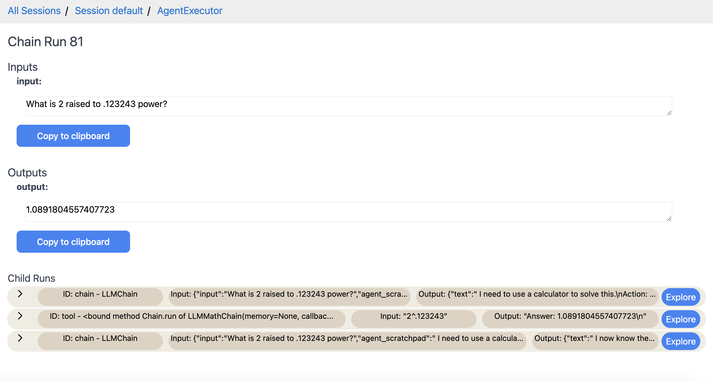

# 追踪（ Tracing ）

通过在LangChain运行中启用追踪功能，您可以更有效地可视化、逐步检查和调试您的链式和代理程序。

首先，您应该安装追踪功能并正确设置您的环境。
您可以使用本地托管版本（使用Docker）或云托管版本（封闭Alpha版）。
如果您有兴趣使用托管平台，请填写[此处的表格](https://forms.gle/tRCEMSeopZf6TE3b6)。

- [本地托管设置](./local_installation.md)
- [云托管设置](./hosted_installation.md)

## 追踪演练 tracing


当您首次访问用户界面时，您应该看到一个包含您的追踪会话的页面。
一个初始的“default”会话已经为您创建。
会话只是一种将追踪分组在一起的方式。
如果您点击一个会话，它将带您到一个没有记录追踪的页面，上面显示“无运行记录”。
您可以使用新会话表单创建一个新的会话。


如果我们点击“default”会话，我们会发现一开始我们没有存储的追踪数据。


如果我们现在启用追踪功能并运行链式和代理程序，我们将在这里看到数据显示出来。
为此，我们可以运行[此笔记本](./agent_with_tracing.html)作为示例。
运行之后，我们将看到一个初始的追踪数据。


从这里，我们可以通过点击箭头展示嵌套运行来对追踪数据进行整体探索。
我们可以不断点击进一步进行更深入的探索。


我们还可以点击顶层运行的“探索”按钮，进一步深入了解。
在这里，我们可以完整地看到输入和输出，以及所有嵌套的追踪数据。



我们可以继续详细探索每个嵌套的追踪数据。
例如，这是最低级别的追踪数据，显示了LLM的精确输入/输出。


## 更改会话

1. 要将追踪记录到除“default”之外的其他会话，请将`LANGCHAIN_SESSION`环境变量设置为您要记录到的会话名称：

```python
import os
os.environ["LANGCHAIN_TRACING"] = "true"
os.environ["LANGCHAIN_SESSION"] = "my_session" # Make sure this session actually exists. You can create a new session in the UI.
```

2. 要在脚本或笔记本中切换会话，请不要设置`LANGCHAIN_SESSION`环境变量。而是使用`langchain.set_tracing_callback_manager(session_name="my_session")`
